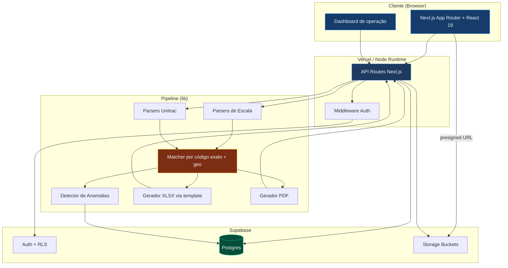

<div align="center">

# KPI TRANSMONSEG

#### Geração e gestão de KPI de entregas para a operação logística da TRANSMONSEG

[](https://nextjs.org)
[](https://www.typescriptlang.org)
[](https://react.dev)
[](https://tailwindcss.com)
[](https://supabase.com)
[](https://kpi-transmonseg.vercel.app)

**[Acessar produção](https://kpi-transmonseg.vercel.app)** • **[GitHub](https://github.com/transmonseg/kpi-transmonseg)**

</div>

> Desenhado, construído e mantido por **[Joaquim Salles](https://github.com/Joaquim-Salles)** para a operação real da TRANSMONSEG. **Em produção.**

---

## O que é

A TRANSMONSEG entrega para **redes de supermercado** (Prezunic, Sendas/Assaí, Zona Sul, Princesa, Superprix, Armazém do Grão, Mundial, Guanabara, Pax e mais). Todo dia precisa cruzar as **escalas de motorista** com o **relatório de rastreamento GPS do Unitrac** para gerar o KPI de cada rede: que horas saiu do CD, chegou na loja, saiu da loja e quanto tempo ficou.

Fazer isso na mão eram **horas** de trabalho por dia. O sistema faz em **segundos** — e ainda monta um dashboard de operação por cima.

```
ESCALAS (5+ formatos, XLSX/PDF)          UNITRAC (PDF/XLSX, GPS por veículo)
         │                                        │
         ▼                                        ▼
   ┌─────────────────────────────────────────────────────┐
   │   Parser dedicado por formato + dedup multi-escala   │
   └─────────────────────────────────────────────────────┘
                              │
                              ▼
   ┌─────────────────────────────────────────────────────┐
   │   Matcher: código exato + recuperação geográfica     │
   │   Lojas cadastradas · nome/fuzzy · geo / troca / N:N  │
   └─────────────────────────────────────────────────────┘
                              │
                              ▼
   ┌─────────────────────────────────────────────────────┐
   │   XLSX (template aprovado) + PDF por rede + auditoria │
   └─────────────────────────────────────────────────────┘
                              │
                              ▼
   ┌─────────────────────────────────────────────────────┐
   │   Dashboard de operação (taxa, falhas, GPS, tempo)   │
   └─────────────────────────────────────────────────────┘
```

---

## Os dois módulos

### 🏭 Geração de KPI — *o pipeline*
Sobe escala + Unitrac → recebe **XLSX e PDF prontos por rede**, no layout exato aprovado pela operação. Pré-visualização editável célula a célula, re-geração in-place sem novo upload, detecção de anomalias e histórico auditável de cada geração.

### 📊 Dashboard de operação — *a visão de negócio*
A partir dos KPIs, monta uma visão analítica: hero metrics (taxa de entrega, não foi ao cliente, cobertura GPS, tempo médio em loja), ranking de lojas problemáticas, tendência por dia, desempenho por rede e volume por turno. Filtros por período e multi-rede, inserção de KPIs manuais, histórico com re-download e export mensal consolidado.

---

## O que está pronto

| Capacidade | Detalhe |
|---|---|
| **Multi-formato** | XLSX nativo (ExcelJS/SheetJS) e PDF (pdf-parse + pdfjs-serverless) |
| **Multi-escala** | Parsers dedicados (GERAL, PAX/Feira/Emanuel, ZONA SUL, ARMAZÉM DO GRÃO, GUANABARA PDF) com dedup automática entre fontes; leitura por cabeçalho (robusto a mudança de coluna) |
| **Match por código exato** | Casa `codigo_unitrac` exato — preciso e auditável |
| **Recuperação geográfica** | Entrega sem geofence casada por coordenada à loja (limiar = raio da loja), marcada pra revisão |
| **Troca de carro / N:N** | Entrega por outra placa (substituto) creditada; 1 placa em N lojas próximas clusterizada por ordem temporal |
| **OCR + Mercosul** | Placas com confusão de leitura (`1↔B`, `9↔J`) e conversão Mercosul (`3↔D`) reconhecidas |
| **Anti-dupla-contagem** | Uma parada nunca credita 2 lojas (geofence sobreposto), exceto cross-dock |
| **Alterações de escala** | Cola WhatsApp / texto livre / PDF → detecta quem sai e quem entra, identifica se trocou motorista / carro / ambos, e credita o substituto |
| **Aviso de relatório parcial** | Avisa quando o KPI foi gerado cedo demais (antes das entregas) pra não mandar dado incompleto |
| **Gerador via template** | XLSX byte-fiel ao modelo aprovado pela operação (1º/2º carro, paleta navy) |
| **Detecção de anomalias** | Inconsistências automáticas (placa sem GPS, tempo invertido, fora da janela…) |
| **Edição inline + re-geração** | Toda a pré-visualização é editável; edita → `Re-gerar` sem re-upload |
| **Histórico auditável** | Cada geração registra autor, momento, arquivos de origem e edições |

---

## Arquitetura



---

## Estrutura do projeto

```
kpi-transmonseg/
│
├── src/
│   ├── app/
│   │   ├── login/, cadastro/          # Auth Supabase
│   │   ├── layout.tsx                 # Root layout + tema anti-FOUC
│   │   ├── globals.css                # Design tokens (cores, radii, motion)
│   │   │
│   │   ├── painel/                    # Área autenticada
│   │   │   ├── page.tsx               # ► Dashboard de operação
│   │   │   ├── dashboard/             # Visão geral · Inserir KPIs · Histórico
│   │   │   ├── kpi/simples/           # Geração de KPI (pipeline principal)
│   │   │   ├── lojas/                 # Cadastro de lojas (codigo_unitrac)
│   │   │   ├── historico/             # Auditoria de gerações
│   │   │   └── cozinha/               # Romaneio Cozinha Industrial
│   │   │
│   │   └── api/                       # Rotas (kpi, dashboard, kpi-manual, escalas, unitrac, lojas)
│   │
│   ├── lib/
│   │   ├── parsers/                   # Parsers de escala, unitrac e alterações
│   │   ├── kpi/                       # matcher, gerador-kpi, dashboard-metricas, anomalia, template-loader…
│   │   ├── supabase/                  # clients browser/server/middleware/service
│   │   ├── lojas/                     # catálogo e match geo de lojas
│   │   └── utils/                     # texto, geo (haversine), placa, score
│   │
│   └── assets/
│       └── kpi-template.xlsx          # Template aprovado do KPI (estilos byte-fiéis)
│
├── supabase/migrations/              # Migrations versionadas
├── docs/                             # Design docs, planos e relatórios
├── scripts/                          # Utilitários (seed, gerar local, comparar)
└── public/  ·  AGENTS.md  ·  package.json
```

---

## Stack técnica

| Camada | Tecnologia |
|---|---|
| Framework | Next.js (App Router + Turbopack) 16.2 |
| Linguagem | TypeScript (strict) |
| UI | React 19 + Tailwind CSS v4 + design tokens próprios |
| Iconografia / Tipografia | Phosphor Icons · Geist Sans/Mono |
| Auth e DB | Supabase (Postgres, RLS, Storage) |
| Parser XLSX / PDF | ExcelJS + SheetJS · pdf-parse + pdfjs-serverless |
| Geração PDF | pdf-lib |
| Fuzzy matching | talisman (Jaro-Winkler + Levenshtein) |
| Deploy | Vercel (auto-deploy de `main`) |

---

## Rodar local

```bash
git clone https://github.com/transmonseg/kpi-transmonseg.git
cd kpi-transmonseg
npm install
cp .env.example .env.local      # preencha as chaves do Supabase
npm run dev                     # http://localhost:3000
```

---

## Deploy

- **Provedor:** Vercel · **Auto-deploy:** push em `main` · cada PR ganha preview
- **URL produção:** [kpi-transmonseg.vercel.app](https://kpi-transmonseg.vercel.app)
- **Runtime:** rotas de KPI usam `runtime = 'nodejs'` (ExcelJS, pdf-lib, pdf-parse)

---

## Créditos

<table>
<tr>
<td valign="top">

#### **[Joaquim Salles](https://github.com/Joaquim-Salles)**

Idealizador, arquiteto e desenvolvedor. Desenhou todo o pipeline de matching, o catálogo de redes/parsers, o gerador via template e o dashboard de operação — e mantém o sistema em produção para a TRANSMONSEG.

</td>
</tr>
</table>

#### Stack que tornou isso possível

[Next.js](https://nextjs.org) • [Supabase](https://supabase.com) • [Tailwind CSS](https://tailwindcss.com) • [ExcelJS](https://github.com/exceljs/exceljs) • [Phosphor Icons](https://phosphoricons.com) • [Vercel](https://vercel.com)

---

<div align="center">

**Construído para a operação da [TRANSMONSEG](https://github.com/transmonseg)** · por **Joaquim Salles**

</div>
