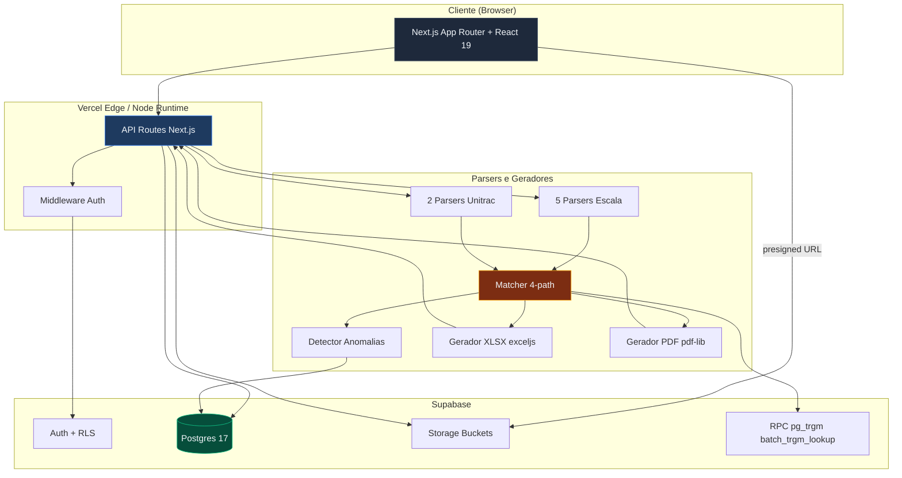
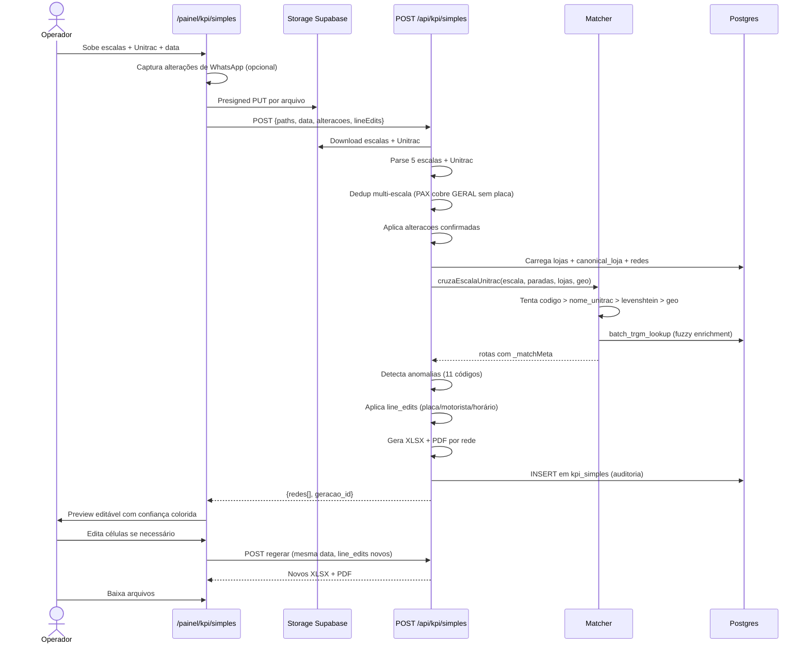

<div align="center">

# KPI TRANSMONSEG

#### Sistema de geração e gestão de KPI de entregas operado pela TRANSMONSEG

[](https://nextjs.org)
[](https://www.typescriptlang.org)
[](https://react.dev)
[](https://tailwindcss.com)
[](https://supabase.com)
[](https://kpi-transmonseg.vercel.app)
[](https://vitest.dev)

**[Acessar produção](https://kpi-transmonseg.vercel.app)** • **[GitHub](https://github.com/transmonseg/kpi-transmonseg)**

</div>

> Desenhado, construído e mantido por **Joaquim Salles** para a operação logística da TRANSMONSEG.

---

## Sumário

- [Em 30 segundos](#em-30-segundos)
- [Capabilities](#capabilities)
- [Arquitetura](#arquitetura)
- [Stack técnica](#stack-técnica)
- [Setup local](#setup-local)
- [Estrutura do projeto](#estrutura-do-projeto)
- [Fluxos principais](#fluxos-principais)
- [Parsers de escala](#parsers-de-escala)
- [Banco de dados](#banco-de-dados)
- [MCP server](#mcp-server)
- [Performance do matcher](#performance-do-matcher)
- [Anomalias detectadas](#anomalias-detectadas)
- [Deploy](#deploy)
- [Convenções](#convenções)
- [Roadmap](#roadmap)
- [Créditos](#créditos)

---

## Em 30 segundos

O sistema lê **escalas de cinco redes** em formatos heterogêneos (XLSX + PDF), cruza com o **relatório de rastreamento Unitrac**, e gera **XLSX + PDF prontos por rede** com horários de saída do CD, chegada na loja, saída da loja e tempo em loja.

Cruzar 240+ entregas por dia de cinco origens diferentes era trabalho manual de 4 horas. O sistema faz em 30 segundos com taxa de automação alvo de **85% +**.

```
ESCALAS (5 redes, XLSX/PDF)              UNITRAC (XLSX/PDF, GPS por veículo)
         |                                        |
         v                                        v
   ┌─────────────────────────────────────────────────────┐
   │   Parser dedicado por formato + dedup multi-escala   │
   └─────────────────────────────────────────────────────┘
                              |
                              v
   ┌─────────────────────────────────────────────────────┐
   │  Matcher 3-path: codigo + nome exato + fuzzy + geo  │
   │  (canonical_loja, alias_loja, batch_trgm_lookup)    │
   └─────────────────────────────────────────────────────┘
                              |
                              v
   ┌─────────────────────────────────────────────────────┐
   │       Detector de anomalias (11 códigos ativos)      │
   └─────────────────────────────────────────────────────┘
                              |
                              v
   ┌─────────────────────────────────────────────────────┐
   │   XLSX + PDF por rede   |  Persiste em kpi_simples   │
   └─────────────────────────────────────────────────────┘
```

---

## Capabilities

| Capacidade | Detalhe |
|---|---|
| **Multi-formato** | XLSX nativo, PDF via pdf-parse e pdfjs-serverless |
| **Multi-escala** | 5 parsers dedicados (GERAL, PAX, ZONA_SUL, ARMAZEM_GRAO, GUANABARA) com dedup automática |
| **Matcher 4-path** | código Unitrac, nome literal, levenshtein fuzzy, geo-proximidade haversine |
| **Geo fallback** | Resolve paradas FORA_BASE sem geofence cadastrada usando 101 lojas canonicais com lat/lng e raio |
| **Trigram batch** | RPC Postgres pg_trgm pra fuzzy enrichment em lote |
| **OCR-tolerant** | Placas Mercosul com confusões 1↔B, 9↔J, 4↔E aceitas se forem únicas no Unitrac |
| **Cross-midnight** | Detecta entregas que cruzam meia-noite (saída < chegada) e calcula tempo correto |
| **11 anomalias** | Detecção automática de inconsistências (placa sem GPS, tempo invertido, fora da janela, etc.) |
| **Edição inline** | Toda a pré-visualização é editável (loja, placa, motorista, turno, horários, tempo) |
| **Re-geração in-place** | Edita > clica `Re-gerar` > novo XLSX/PDF com overrides sem re-upload |
| **Histórico auditável** | Cada geração registra autor, momento, arquivos de origem, alterações, edições e summary |
| **Alterações em lote** | Cola mensagem crua do WhatsApp > parser detecta sai/entra/motivo/confiança > aplica em massa |
| **Confiança visual** | Header da rede mostra `Nh / Nl / N?` (high/low/unmatched). Linhas com anomalia HIGH viram danger-soft com tooltip |

---

## Arquitetura



---

## Stack técnica

| Camada | Tecnologia | Versão |
|---|---|---|
| Framework | Next.js (App Router + Turbopack) | 16.2.6 |
| Linguagem | TypeScript (strict) | 5.x |
| Runtime React | React | 19.2.4 |
| UI | Tailwind CSS | 4.x |
| Iconografia | Phosphor Icons | 2.1 |
| Tipografia | Geist Sans + Mono | 1.7 |
| Auth e DB | Supabase (Postgres 17, RLS, Storage) | 0.10 |
| Parser XLSX | ExcelJS + SheetJS (vendor tarball) | 4.4 + 0.20.3 |
| Parser PDF | pdf-parse + pdfjs-serverless | 1.1 + 1.2 |
| Geração PDF | pdf-lib | 1.17 |
| Fuzzy matching | talisman (Jaro-Winkler + Levenshtein) | 1.1 |
| Animação | motion | 12.38 |
| Testes | Vitest + happy-dom | 4.1 + 20.9 |
| Validação | Zod | 4.4 |
| MCP | `@modelcontextprotocol/sdk` | 1.29 |
| Deploy | Vercel (auto-deploy de `main`) | — |

---

## Setup local

#### Pré-requisitos

- Node 24 LTS+
- Conta Supabase com projeto criado
- Acesso de `read` ao GitHub `transmonseg/kpi-transmonseg`

#### Passo a passo

```bash
# 1. Clonar
git clone https://github.com/transmonseg/kpi-transmonseg.git
cd kpi-transmonseg

# 2. Instalar
npm install

# 3. Variáveis de ambiente
cp .env.example .env.local
# preencha com as chaves do projeto Supabase (URL, ANON_KEY, SERVICE_ROLE_KEY)

# 4. Migrations (via Supabase CLI ou painel)
supabase db push

# 5. Dev server
npm run dev
# abrir http://localhost:3000
```

#### Scripts disponíveis

```bash
npm run dev          # dev server (turbopack)
npm run build        # build produção
npm start            # rodar produção
npm run lint         # eslint
npm test             # vitest run (66 testes)
npm run test:watch   # vitest watch
npm run test:coverage # cobertura
```

---

## Estrutura do projeto

```
kpi-transmonseg/
│
├── src/
│   ├── app/
│   │   ├── page.tsx                   # Landing pública
│   │   ├── login/, cadastro/          # Auth Supabase
│   │   ├── painel/                    # Área autenticada
│   │   │   ├── page.tsx               # Dashboard (stats + atalhos)
│   │   │   ├── kpi/simples/           # Geração de KPI (UI principal)
│   │   │   ├── alteracoes/nova/       # Form V2 de alterações em lote
│   │   │   ├── lojas/                 # Registro canônico de lojas
│   │   │   ├── cozinha/               # Romaneio Cozinha Industrial
│   │   │   ├── revisao/               # Fila de revisão de anomalias
│   │   │   └── historico/             # Auditoria de gerações
│   │   │
│   │   └── api/                       # 27 rotas (kpi, escalas, unitrac, alteracoes, lojas)
│   │
│   ├── lib/
│   │   ├── parsers/                   # 20 arquivos: escala, unitrac, alteracoes
│   │   ├── kpi/                       # matcher, gerador-kpi, gerador-pdf, anomalia, trgm
│   │   ├── supabase/                  # clients browser/server/middleware/service
│   │   ├── lojas/                     # trigram lookup canonical, matriz de lojas
│   │   ├── utils/                     # texto, geo (haversine), placa, score
│   │   ├── hooks/, theme/, types/
│   │   └── polyfills/
│   │
│   └── components/
│       ├── ui/                        # DS interno (Button, Card, Input, Badge)
│       ├── ApplyToSimilarSheet.tsx
│       └── FilaRevisao.tsx
│
├── mcp/
│   └── server.ts                      # MCP server (8 tools p/ Claude Code)
│
├── supabase/
│   └── migrations/                    # 13 migrations versionadas com timestamp
│
├── scripts/                           # 11 utilitários (seed, gerar local, comparar)
│   └── dev/                           # 33 debug histórico (não é parte do produto)
│
├── docs/
│   ├── analise-kpi-dia15.md           # Análise técnica de cobertura
│   ├── sessoes/                       # Relatórios datados
│   └── superpowers/                   # Specs e plans
│
├── public/                            # Assets estáticos
├── vendor/
│   └── xlsx-0.20.3.tgz                # SheetJS vendorado
│
├── .env.example                       # Template de variáveis
├── AGENTS.md                          # Regras para agentes IA
└── package.json
```

#### Stats do código

| Métrica | Valor |
|---|---|
| Commits no main | **205+** |
| Rotas Next.js (page + api) | **40** |
| Parsers em `src/lib/parsers/` | **20** |
| Módulos KPI em `src/lib/kpi/` | **13** |
| Migrations Supabase | **13** |
| Testes Vitest | **66** verdes |

---

## Fluxos principais

### Fluxo 1: KPI Simples (geração diária)



### Fluxo 2: Alterações em Lote

Cola mensagem crua do WhatsApp na rota `/painel/alteracoes/nova`. O parser detecta:

- `sai`: motorista e/ou placa que saiu
- `entra`: motorista e/ou placa novos
- `rede_id` e `filial`: rede e código identificados por âncoras
- `motivo`: razão da troca
- `confianca`: alta, média ou baixa baseado em quanto foi parseado

Operador confirma cada bloco com badge de confiança, edita se preciso, e aplica em lote. O endpoint `aplicar-lote` atualiza `escala_linhas` no banco para todas as redes afetadas.

### Fluxo 3: Reabrir Geração Salva

A página `/painel/historico` lista todas as gerações de `kpi_simples`. Clicar `Reabrir` carrega a página simples com `?geracao=ID`, que dispara `POST /api/kpi/simples/regerar` re-baixando os arquivos do Storage e re-rodando o pipeline com as mesmas alterações e edições. Sem duplicar registro no banco.

---

## Parsers de escala

| Parser | Arquivo origem | Particularidades |
|---|---|---|
| **escala-geral** | XLSX consolidado mensal | Layout multi-rede em colunas paralelas, deduplica linhas multi-entrega (Búzios 1/2/3) |
| **escala-pax** | XLSX da PAX | Cobre redes da GERAL sem placa (PAX é a fonte real de placa/motorista para SUPER_PAX, EMANUEL, FEIRA_NOVA) |
| **escala-zona-sul** | XLSX Zona Sul | Aba MATRIZ, ignora rows `Atenção` que viravam linhas-fantasma |
| **escala-armazem-grao** | XLSX Armazém do Grão | Colunas de fornecedor a partir da 13ª, parser dedicado obrigatório |
| **escala-guanabara-pdf** | PDF HLOG | Parseia tokens com posição absoluta, suporta formato "grudado" do `pdf-parse v1` (Caminho 2 com regex `PLACA_TIPO_RE`) |

Detector automático: roda parsers em ordem e fica com o primeiro que retornar `≥ 3` linhas reconhecidas. PDFs vão direto pro `escala-guanabara-pdf`.

---

## Banco de dados

#### Tabelas principais

| Tabela | Função |
|---|---|
| `escala_uploads` | Cada arquivo XLSX/PDF de escala enviado, com tipo e qtd_linhas |
| `escala_linhas` | Linhas parseadas das escalas (motorista, placa, loja, turno, rede, data) |
| `unitrac_uploads` | Cada arquivo Unitrac, vinculado a data_relatorio |
| `paradas` | Cada parada GPS extraída do Unitrac (lat, lng, chegada, saida, classificação) |
| `lojas` | Catálogo operacional (312 ativas, 307 com geo, 188 com codigo_unitrac) |
| `redes` | Catálogo de redes com janelas operacionais (MANHA/TARDE) |
| `canonical_loja` | Catálogo canônico para fuzzy lookup (110 entradas, 101 com geo + raio) |
| `alias_loja` | Aliases de lojas para resolução de variações de nome (110 entradas) |
| `kpi_simples` | Histórico de cada geração (paths, alterações, edits, summary por rede) |
| `alteracoes` | Alterações de motorista/placa aplicadas em escala_linhas |
| `anomalias` | 11 códigos detectados automaticamente em cada geração |
| `review_queue` | Fila de revisão manual (Tia Érica resolve casos LOW) |
| `cozinha_clientes` | Romaneio Cozinha Industrial |

#### Migrations versionadas

```
20260516000000_storage_policies.sql      Buckets escalas-raw, unitrac-raw com RLS
20260516010000_unique_constraints.sql    Indexes únicos
20260518_clientes_cozinha.sql            Cozinha módulo
20260519000100_extensions.sql            pg_trgm + unaccent
20260519000200_canonical_loja.sql        Canonical catalog
20260519000300_alias_loja.sql            Alias table
20260519000400_review_queue.sql          Fila de revisão manual
20260519000500_rpc_batch.sql             batch_trgm_lookup RPC
20260519000600_rpc_approve.sql           Approval workflow
20260519000700_cron_decay.sql            Cron de manutenção
20260519000800_fix_rpcs_and_rls.sql      Hotfix RLS
20260519001000_analise_ia.sql            Logs análise
20260520000000_kpi_simples.sql           Persistência KPI Simples (autor, paths, summary)
```

---

## MCP Server

`mcp/server.ts` expõe o pipeline inteiro como tools nativas para Claude Code. Útil para debug rápido de parsers direto da IDE sem mexer no app.

| Tool | Função |
|---|---|
| `parse_escala_geral` | Parseia XLSX da escala geral |
| `parse_escala_zona_sul` | Parseia XLSX Zona Sul |
| `parse_escala_pax` | Parseia XLSX PAX |
| `parse_escala_armazem_grao` | Parseia XLSX Armazém do Grão |
| `parse_escala_guanabara_pdf` | Parseia PDF HLOG |
| `parse_unitrac` | XLSX Unitrac |
| `parse_unitrac_pdf` | PDF Unitrac (pdf-parse + pdfjs-serverless fallback) |
| `load_files` | Carga em lote no Supabase |
| `processar_kpi` | Roda matcher + anomalias |
| `gerar_kpi` | Gera XLSX/PDF |
| `query_kpi` | Consulta histórico |
| `clear_data` | Limpa dados de teste |

---

## Performance do matcher

> Métrica: porcentagem de `escala_linhas` com `placa_norm` que ganharam parada GPS atribuída pelo matcher.

#### Evolução por rede (dia 18/05/2026)

| Rede | Match | Cobertura | Tendência |
|---|---:|---:|---|
| PRINCESA | 24/26 | **92%** | estável |
| EMANUEL (PAX) | 5/6 | **83%** | +33pp |
| PREZUNIC | 31/40 | **78%** | estável |
| FEIRA_NOVA | 9/12 | **75%** | +8pp |
| PAX geral | 22/30 | **73%** | +13pp |
| GERAL | 103/149 | **71%** | +17pp |
| SENDAS | 7/10 | **70%** | +30pp |
| SUPERPRIX | 7/10 | **70%** | +10pp |
| SUPER_PAX (PAX) | 8/12 | **67%** | +9pp |
| ASSAI | 24/42 | **60%** | +10pp |
| CARREFOUR | 6/11 | **60%** | estável |
| ZONA_SUL | 41/70 | **59%** | +18pp |
| ARMAZEM_GRAO | 8/14 | **57%** | +43pp |
| **Total** | **155/260** | **~70%** | **+20pp em 1 sessão** |

#### Plano de ataque para 85%+

| Fase | Mecanismo | Impacto esperado |
|---|---|---|
| Baseline | matcher 4-path + dedup | 70% |
| **FIX-1 ativo** | geo-proximidade + trgm + lojas operacionais carregadas | **+20 a 28 linhas → ~85%** |
| **FIX-5 ativo** | match exato por `nome_unitrac` | **+5 a 10 linhas → ~87%** |
| Review queue (UI) | Operadora resolve casos LOW | +8 a 12 linhas → 90% |
| Cadastros faltantes | Cadastrar placas terceirizadas no Unitrac | +38 linhas teóricas (Categoria A) |

#### Categorias dos no-matches restantes

```
TOTAL DESMATCHED ANTES DOS FIXES: 105 linhas

  ▓▓▓▓▓▓▓▓▓▓ 38  Categoria A  Placa não cadastrada no Unitrac (terceirizado)
  ▓▓▓▓▓▓▓▓   32  Categoria B  Placa OK, sem geofence (resolve com geo)  ← FIX-1
  ▓▓▓▓▓▓▓▓▓  35  Categoria C  Cross-docking ou cadastro errado Unitrac
```

---

## Anomalias detectadas

11 códigos ativos em `src/lib/kpi/anomalia.ts`:

| Código | Severidade | Detecta |
|---|---|---|
| ANOM-01 | HIGH | Placa na escala mas sem nenhum dado GPS no Unitrac |
| ANOM-02 | LOW | Placa no Unitrac mas sem linha na escala (extra-escala) |
| ANOM-03 | MEDIUM | Parada com `chegada == saida` (placeholder GPS) |
| ANOM-04 | HIGH | Saída anterior à chegada (cruzamento meia-noite ou dado inconsistente) |
| ANOM-05 | MEDIUM | Quantidade de paradas LOJA ≠ 1 para loja única na escala |
| ANOM-06 | HIGH | Paradas registradas sem saída do CD identificada |
| ANOM-07 | HIGH | Chegada na primeira parada antes da saída do CD |
| ANOM-08 | MEDIUM | Tempo em loja > 4h (240 min) |
| ANOM-10 | LOW | EMANUEL com loja não normalizada no catálogo |
| ANOM-11 | LOW | Saída do CD fora da janela operacional da rede |

Anomalias `HIGH` viram `bg-danger-soft` na pré-visualização e bloqueiam finalização sem revisão. Cada linha mostra tooltip com os códigos atribuídos.

---

## Deploy

- **Provedor:** Vercel
- **Auto-deploy:** push em `main`
- **Preview:** cada PR ganha URL única
- **URL produção:** [kpi-transmonseg.vercel.app](https://kpi-transmonseg.vercel.app)
- **Variáveis:** configuradas no painel Vercel do projeto `kpi-transmonseg`
- **Edge vs Node:** rotas KPI usam `runtime = 'nodejs'` (precisa de ExcelJS, pdf-lib, pdf-parse)
- **Max duration:** 120s por geração

---

## Convenções

- **Português** em commits, código de domínio, comentários e docs com acentuação correta
- **Travessão** somente em texto editorial. Nunca em copy de produto
- **Commits no formato** `<tipo>(<escopo>): <descrição>` — tipos válidos: `feat`, `fix`, `refactor`, `chore`, `docs`, `test`
- **Sem `console.log`** em produção. Apenas `console.error` em erro real
- **Rodar `npm test`** antes de mexer em parser ou matcher
- **RLS sempre habilitado** em tabelas novas (`gerado_por = auth.uid()` é o padrão)
- **Edge cases** documentados em testes vitest, não em comentários
- **Sem mocks de banco** em testes de integração de pipeline

---

## Roadmap

#### Curto prazo

- [x] Persistência de gerações com auditoria
- [x] Edição inline completa da tabela
- [x] Geo-fallback ativo no matcher
- [x] Detecção de anomalias inline no fluxo simples
- [ ] UI completa da `review_queue` para resolução manual de casos LOW
- [ ] Confidence histogram por rede no histórico

#### Médio prazo

- [ ] Hungarian algorithm para optimal assignment com `nL > 5` (hoje cai em greedy)
- [ ] Pipeline OCR para placas borradas em PDF Unitrac
- [ ] Webhook de notificação ao concluir geração
- [ ] Export para CSV além de XLSX e PDF

#### Longo prazo

- [ ] Modo white-label para outras transportadoras
- [ ] Dashboard de cobertura GPS por rede ao longo do tempo
- [ ] Detecção automática de cross-docking (Categoria C dos no-matches)
- [ ] Integração direta com API do Unitrac (sem upload manual)

---

## Créditos

<table>
<tr>
<td valign="top">

#### **Joaquim Salles**

Idealizador, arquiteto e mantenedor do sistema. Desenhou todo o pipeline de matching, definiu o catálogo de redes e parsers, e mantém o sistema em produção para a operação real da TRANSMONSEG.

</td>
</tr>
</table>

#### Stack que tornou isso possível

[Next.js](https://nextjs.org) • [Supabase](https://supabase.com) • [Tailwind CSS](https://tailwindcss.com) • [ExcelJS](https://github.com/exceljs/exceljs) • [Phosphor Icons](https://phosphoricons.com) • [Vitest](https://vitest.dev) • [Vercel](https://vercel.com)

---

<div align="center">

**Construído para a operação da [TRANSMONSEG](https://github.com/transmonseg)**

</div>
