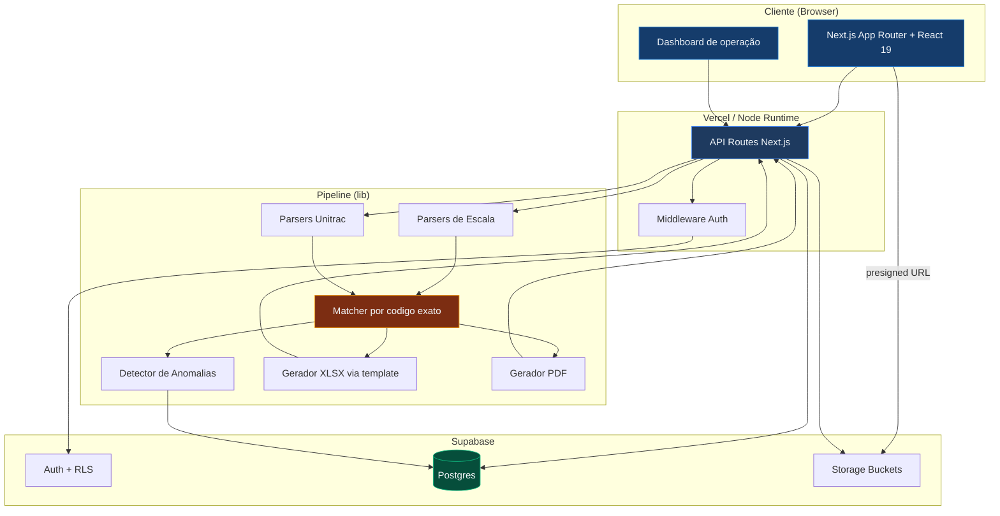
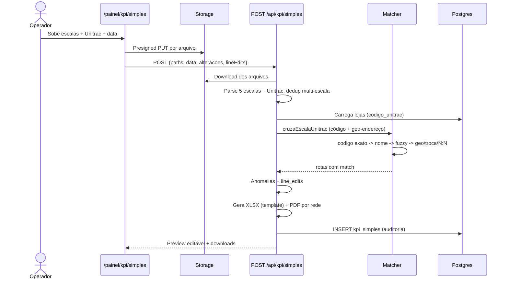

<div align="center">

# KPI TRANSMONSEG

#### Geração e gestão de KPI de entregas para a operação logística da TRANSMONSEG

[](https://nextjs.org)
[](https://www.typescriptlang.org)
[](https://react.dev)
[](https://tailwindcss.com)
[](https://supabase.com)
[](https://kpi-transmonseg.vercel.app)
[](https://vitest.dev)

**[Acessar produção](https://kpi-transmonseg.vercel.app)** • **[GitHub](https://github.com/transmonseg/kpi-transmonseg)**

</div>

> Desenhado, construído e mantido por **Joaquim Salles** para a operação real da TRANSMONSEG.

---

## Sumário

- [Em 30 segundos](#em-30-segundos)
- [Os dois módulos](#os-dois-módulos)
- [Capabilities](#capabilities)
- [Arquitetura](#arquitetura)
- [Stack técnica](#stack-técnica)
- [Setup local](#setup-local)
- [Estrutura do projeto](#estrutura-do-projeto)
- [Fluxos principais](#fluxos-principais)
- [Parsers de escala](#parsers-de-escala)
- [Matcher: como o GPS vira KPI](#matcher-como-o-gps-vira-kpi)
- [Gerador XLSX via template](#gerador-xlsx-via-template)
- [Banco de dados](#banco-de-dados)
- [Anomalias detectadas](#anomalias-detectadas)
- [Deploy](#deploy)
- [Convenções](#convenções)
- [Roadmap](#roadmap)
- [Créditos](#créditos)

---

## Em 30 segundos

A TRANSMONSEG entrega para **redes de supermercado** (Prezunic, Sendas/Assaí, Zona Sul, Princesa, Superprix, Armazém do Grão, Mundial, Guanabara, Pax e mais). Todo dia precisa cruzar **escalas de motorista** com o **relatório de rastreamento GPS do Unitrac** para gerar o KPI de cada rede: que horas saiu do CD, chegou na loja, saiu da loja e quanto tempo ficou.

Fazer isso na mão eram **horas** de trabalho por dia. O sistema faz em **segundos** — e ainda monta um dashboard de operação por cima.

```
ESCALAS (5+ formatos, XLSX/PDF)          UNITRAC (PDF/XLSX, GPS por veículo)
         │                                        │
         ▼                                        ▼
   ┌─────────────────────────────────────────────────────┐
   │   Parser dedicado por formato + dedup multi-escala   │
   └─────────────────────────────────────────────────────┘
                              │
                              ▼
   ┌─────────────────────────────────────────────────────┐
   │   Matcher: código exato + recuperação geográfica     │
   │   419 lojas · nome/fuzzy · geo-endereço/troca/N:N     │
   └─────────────────────────────────────────────────────┘
                              │
                              ▼
   ┌─────────────────────────────────────────────────────┐
   │   XLSX (template aprovado) + PDF por rede + auditoria │
   └─────────────────────────────────────────────────────┘
                              │
                              ▼
   ┌─────────────────────────────────────────────────────┐
   │   Dashboard de operação (taxa, falhas, GPS, tempo)   │
   └─────────────────────────────────────────────────────┘
```

---

## Os dois módulos

O sistema tem duas frentes que se complementam:

### 🏭 Geração de KPI — *o pipeline*

Sobe escala + Unitrac → recebe **XLSX e PDF prontos por rede**, no layout exato aprovado pela operação. Pré-visualização editável célula a célula, re-geração in-place sem novo upload, detecção de anomalias e histórico auditável de cada geração.

### 📊 Dashboard de operação — *a visão de negócio*

A partir dos KPIs inseridos, monta uma visão analítica em **pirâmide invertida** (NN/g):

- **Resumo** — 4 hero metrics: taxa de entrega, não foi ao cliente, cobertura GPS, tempo médio em loja, com barra empilhada 100% do mix de status.
- **Onde agir agora** — ranking de lojas problemáticas (sem GPS + não foi) e exceções do dia.
- **Contexto** — tendência por dia, desempenho por rede (barras horizontais), volume por turno.

Filtros por período (dia/semana/mês) e multi-rede, **inserção de KPIs manuais** por rede (upload XLSX), **histórico** com re-download, e **export mensal** consolidando os arquivos de cada dia numa aba por dia — preservando o layout original.

---

## Capabilities

| Capacidade | Detalhe |
|---|---|
| **Multi-formato** | XLSX nativo (ExcelJS/SheetJS) e PDF (pdf-parse + pdfjs-serverless) |
| **Multi-escala** | Parsers dedicados (GERAL, PAX/Feira/Emanuel, ZONA SUL, ARMAZÉM DO GRÃO, GUANABARA PDF) com dedup automática entre fontes |
| **Match por código exato** | Base: casa `codigo_unitrac` exato (preciso, auditável). 419 lojas no cadastro |
| **Recuperação geográfica** | Entrega sem geofence (`FORA_BASE`) casada por coord à loja (limiar = raio da loja), sempre marcada pra revisão |
| **Troca de carro / substituição** | Entrega feita por OUTRA placa (substituto) creditada quando código E coordenada batem |
| **Geo multi-entrega (N:N)** | 1 placa em N lojas próximas: clusteriza paradas e atribui por ordem temporal (1ª→1ª) |
| **OCR + Mercosul** | Placas com confusão de leitura (`1↔B`, `9↔J`) e conversão Mercosul (`3↔D`) reconhecidas |
| **Anti-dupla-contagem** | Uma parada nunca credita 2 lojas diferentes (geofence sobreposto) — exceto cross-dock |
| **Cross-midnight** | Entregas que cruzam meia-noite (saída < chegada) com tempo correto |
| **Alterações de escala** | Cola WhatsApp cru → parser detecta entra/sai/troca-de-carro/loja → aplica e credita o substituto |
| **Gerador via template** | XLSX gerado a partir de um template aprovado (Calibri, paleta navy, 1º/2º carro) — byte-fiel ao modelo da operação |
| **Detecção de anomalias** | Inconsistências automáticas no pipeline (placa sem GPS, tempo invertido, fora da janela…) |
| **Edição inline** | Toda a pré-visualização é editável (loja, placa, motorista, turno, horários, tempo) |
| **Re-geração in-place** | Edita → `Re-gerar` → novo XLSX/PDF com overrides sem re-upload |
| **Dashboard de entregas** | Visão analítica em 3 faixas, filtros multi-rede, inserir/histórico de KPIs manuais, export mensal |
| **Histórico auditável** | Cada geração registra autor, momento, arquivos de origem, alterações e edições |
| **Alterações em lote** | Cola mensagem crua de WhatsApp → parser detecta sai/entra/motivo/confiança → aplica em massa |

---

## Arquitetura



---

## Stack técnica

| Camada | Tecnologia | Versão |
|---|---|---|
| Framework | Next.js (App Router + Turbopack) | 16.2.6 |
| Linguagem | TypeScript (strict) | 5.x |
| Runtime React | React | 19.2.4 |
| UI | Tailwind CSS v4 + design tokens próprios | 4.x |
| Iconografia | Phosphor Icons | 2.1 |
| Tipografia | Geist Sans + Geist Mono | — |
| Auth e DB | Supabase (Postgres, RLS, Storage) | 2.105 |
| Parser XLSX | ExcelJS + SheetJS (vendor tarball) | 4.4 + 0.20.3 |
| Parser PDF | pdf-parse + pdfjs-serverless | 1.1 + 1.2 |
| Geração PDF | pdf-lib | 1.17 |
| Fuzzy matching | talisman (Jaro-Winkler + Levenshtein) | 1.1 |
| Animação | motion | 12.38 |
| Testes | Vitest + happy-dom | 4.1 |
| Deploy | Vercel (auto-deploy de `main`) | — |

---

## Setup local

#### Pré-requisitos

- Node 24 LTS+
- Projeto Supabase com as migrations aplicadas
- Acesso ao repositório `transmonseg/kpi-transmonseg`

```bash
# 1. Clonar e instalar
git clone https://github.com/transmonseg/kpi-transmonseg.git
cd kpi-transmonseg
npm install

# 2. Variáveis de ambiente
cp .env.example .env.local      # preencha as chaves do Supabase

# 3. Migrations
supabase db push

# 4. Dev server
npm run dev                     # http://localhost:3000
```

#### Scripts

```bash
npm run dev           # dev server (Turbopack)
npm run build         # build de produção
npm start             # rodar produção
npm run lint          # eslint
npm test              # vitest run (425 testes)
npm run test:watch    # vitest watch
npm run test:coverage # cobertura
```

> ⚠️ **Este Next.js tem breaking changes** — APIs e convenções podem diferir do que você conhece. Consulte `node_modules/next/dist/docs/` antes de escrever código (ver `AGENTS.md`).

---

## Estrutura do projeto

```
kpi-transmonseg/
│
├── src/
│   ├── app/
│   │   ├── login/, cadastro/          # Auth Supabase
│   │   ├── layout.tsx                 # Root layout + tema anti-FOUC
│   │   ├── globals.css                # Design tokens (cores, radii, motion, text-*)
│   │   │
│   │   └── painel/                    # Área autenticada
│   │       ├── page.tsx               # ► Dashboard de operação (tela inicial)
│   │       ├── nav.tsx                # Sidebar com grupos expansíveis (KPI, Cozinha)
│   │       ├── dashboard/             # Visão geral · Inserir KPIs · Histórico · Print
│   │       ├── kpi/simples/           # Geração de KPI (pipeline principal)
│   │       ├── lojas/                 # Cadastro de lojas (codigo_unitrac)
│   │       ├── historico/             # Auditoria de gerações
│   │       └── cozinha/               # Romaneio Cozinha Industrial + Clientes
│   │
│   ├── app/api/                       # 26 rotas (kpi, dashboard, kpi-manual, escalas, unitrac, lojas)
│   │
│   ├── lib/
│   │   ├── parsers/                   # 24 parsers: escala, unitrac, alteracoes
│   │   ├── kpi/                       # 20 módulos: matcher, gerador-kpi, dashboard-metricas,
│   │   │                              #   parse-kpi-manual, export-mensal, anomalia, template-loader
│   │   ├── supabase/                  # clients browser/server/middleware/service
│   │   ├── lojas/                     # catálogo e matriz de lojas
│   │   ├── data-br.ts                 # data no fuso de Brasília (BRT)
│   │   └── utils/                     # texto, geo (haversine), placa, score
│   │
│   └── assets/
│       └── kpi-template.xlsx          # Template aprovado do KPI (estilos byte-fiéis)
│
├── supabase/migrations/              # 19 migrations versionadas
├── scripts/                          # utilitários (seed, gerar local, comparar)
├── public/  ·  vendor/xlsx-0.20.3.tgz  ·  AGENTS.md  ·  package.json
```

#### Números do projeto

| Métrica | Valor |
|---|---|
| Commits no `main` | **596** |
| Rotas (page + api) | **39** |
| Parsers | **24** |
| Módulos KPI | **20** |
| Migrations Supabase | **19** |
| Lojas ativas | **419** |
| Testes Vitest | **425** verdes |

---

## Fluxos principais

### Geração de KPI



### Dashboard de operação

`/painel` consome os **KPIs manuais inseridos** (a operação sobe o XLSX de cada rede pela aba *Inserir KPIs*). A aba *Visão geral* calcula as métricas (`dashboard-metricas.ts`), filtradas por período e rede. O *Histórico* lista os dias com re-download, e o *export mensal* (`export-mensal.ts`) junta os XLSX de um mês numa aba por dia preservando o layout. No topo, uma faixa de **operação** reúne cobertura GPS dos últimos 14 dias e a última geração.

### Alterações em lote

Cola a mensagem crua do WhatsApp → o parser detecta `sai`/`entra`/`rede`/`filial`/`motivo`/`confiança`. O operador confirma cada bloco (badge de confiança), edita se preciso, e aplica em massa em `escala_linhas`.

---

## Parsers de escala

| Parser | Origem | Particularidade |
|---|---|---|
| **escala-geral** | XLSX consolidado mensal | Layout multi-rede em colunas paralelas; deduplica multi-entrega (Búzios 1/2/3) |
| **escala-pax** | XLSX PAX/Feira/Emanuel | Fonte real de placa/motorista para SUPER_PAX, EMANUEL, FEIRA_NOVA (cobre a GERAL sem placa) |
| **escala-zona-sul** | XLSX Zona Sul | Filiais na aba `ENDEREÇO - FILIAIS`; ignora linhas-fantasma de frete |
| **escala-armazem-grao** | XLSX Armazém do Grão | Colunas de fornecedor; parser dedicado obrigatório |
| **escala-guanabara-pdf** | PDF HLOG | Tokens por posição absoluta; suporta formato "grudado" do `pdf-parse` |

Detector automático: roda os parsers em ordem e fica com o primeiro que retornar `≥ 3` linhas reconhecidas. PDFs vão direto pro parser de coordenadas.

---

## Matcher: como o GPS vira KPI

O matcher (`src/lib/kpi/matcher.ts`) cruza cada linha de escala com as paradas GPS do Unitrac. A base é o **casamento por código exato** (`codigo_unitrac`) — preciso e auditável. Em cima disso, uma **camada de recuperação geográfica** (`geoEndereco: true`) resgata as entregas que o Unitrac não fechou por código (parada `FORA_BASE`, sem geofence cadastrado), sempre marcando `requiresReview` — não entra cego no KPI do cliente.

```
Camada 1 ─ casamento por código/nome (assignment Hungarian por placa)
  Priority 1 ─ codigo_unitrac exato      ← decide a maioria
  Priority 2 ─ nome_unitrac literal
  Priority 3 ─ Levenshtein fuzzy (<=2)

Camada 2 ─ recuperação geográfica (revisão)
  · geo-endereço   ─ FORA_BASE casado pela COORD à loja (limiar = raio da loja,
                     100-200m; acima exige confirmação de rua/bairro)
  · troca de carro ─ entrega de OUTRA placa (substituto) que bate código E coord
  · geo N:N        ─ 1 placa, N lojas próximas: clusteriza paradas e atribui por
                     ORDEM TEMPORAL (1ª parada → 1ª entrega) — caso multi-entrega
```

Em cima disso, regras finas e **redes de segurança** tratam o mundo real do Unitrac: consolidação de movimentações coladas no cliente (chegada = 1ª, saída = última), placa duplicada Mercosul (`3↔D` na conversão de placa), **anti-dupla-contagem** (uma parada nunca credita 2 lojas diferentes), guard `saída CD > chegada`, tolerância OCR de placa, e aviso de **relatório parcial** quando gerado antes da janela de entrega da rede.

> O cadastro de lojas é validado contra as **escalas reais** antes de entrar — o Unitrac lista muitos clientes que a operação não atende, então só vira loja o que aparece na operação.

---

## Gerador XLSX via template

Em vez de recriar estilos no código (sempre divergindo num detalhe), o gerador parte de **`src/assets/kpi-template.xlsx`** — exportado do próprio arquivo aprovado pela operação:

- Linhas 1-4 = cabeçalho pronto (título navy, faixas 1º/2º carro, header).
- Linhas 5/6 = modelos de linha de dados (primeira/demais).
- Cada loja **clona o estilo-modelo**; o resultado é **byte-fiel** ao modelo (Calibri, paleta `153C6B`/`1976D2`/`E3F2FD`, freeze `A5`, paisagem, aba `DD.MM`).

O export mensal consolida os XLSX já aprovados de cada dia numa aba por dia, copiando célula+estilo+merges — sem regenerar nada.

---

## Banco de dados

| Tabela | Função |
|---|---|
| `lojas` | Catálogo operacional (419 lojas, casadas por `codigo_unitrac`) |
| `redes` | Catálogo de redes com janelas operacionais |
| `escala_uploads` · `escala_linhas` | Arquivos de escala e linhas parseadas |
| `unitrac_uploads` · `paradas` | Arquivos Unitrac e paradas GPS extraídas |
| `kpi_simples` | Histórico de cada geração (paths, alterações, edits, summary) |
| `kpi_manual_entradas` | KPIs manuais inseridos pelo dashboard (status por loja, por rede/dia) |
| `alteracoes` | Alterações de motorista/placa aplicadas em `escala_linhas` |
| `anomalias` | Inconsistências detectadas no pipeline |
| `cozinha_clientes` | Romaneio Cozinha Industrial |

19 migrations versionadas com timestamp — desde políticas de Storage e extensões (`pg_trgm`, `unaccent`) até `kpi_simples` e o módulo de **KPIs manuais** (`kpi_manual_entradas` + bucket `kpi-manual-raw`). Storage buckets com RLS para escalas, Unitrac e XLSX manuais crus.

---

## Anomalias detectadas

O detector (`src/lib/kpi/anomalia.ts`) marca inconsistências em cada geração:

| Detecta | Severidade |
|---|---|
| Placa na escala mas sem nenhum dado GPS | HIGH |
| Saída anterior à chegada (cruzamento meia-noite ou erro) | HIGH |
| Paradas sem saída do CD identificada | HIGH |
| Chegada na 1ª parada antes da saída do CD | HIGH |
| Parada com `chegada == saída` (placeholder GPS) | MEDIUM |
| Tempo em loja acima do esperado | MEDIUM |
| Saída do CD fora da janela operacional | LOW |
| Placa no Unitrac mas sem linha na escala | LOW |

Anomalias `HIGH` puxam o olho na pré-visualização e pedem revisão antes de finalizar.

---

## Deploy

- **Provedor:** Vercel · **Auto-deploy:** push em `main` · cada PR ganha preview
- **URL produção:** [kpi-transmonseg.vercel.app](https://kpi-transmonseg.vercel.app)
- **Runtime:** rotas de KPI usam `runtime = 'nodejs'` (ExcelJS, pdf-lib, pdf-parse)
- **Empacotamento:** `outputFileTracingIncludes` garante o `kpi-template.xlsx` na função serverless
- **Max duration:** 60-120s por geração

---

## Convenções

- **Português** em commits, código de domínio, comentários e docs, com acentuação correta
- **Sem travessão (—)** em copy de produto; só em texto editorial
- **Commits** no formato `<tipo>(<escopo>): <descrição>` — `feat`, `fix`, `refactor`, `chore`, `docs`, `test`
- **Horário em Brasília (BRT)** na UI — nunca `toISOString()` cru (use `hojeBR()`)
- **Convenção de tempo:** parsers gravam BRT como `Date.UTC(...)` e leem com `getUTCHours()` direto
- **`npm test`** antes de mexer em parser ou matcher · **RLS sempre** em tabelas novas

---

## Roadmap

#### Feito recentemente

- [x] **Camada de recuperação geográfica** — geo-endereço (raio da loja), troca de carro (substituto), geo N:N por ordem temporal
- [x] **Alterações de escala robustas** — parser (separadores, "Placa:" solta, loja sem rede) + aplicação que credita o substituto
- [x] **Redes de segurança** — anti-dupla-contagem, placa Mercosul (`3↔D`), guard `saída CD > chegada`, determinismo (ORDER BY)
- [x] **Aviso de relatório parcial** por janela de entrega da rede
- [x] Dashboard de operação (3 faixas, inserir/histórico de KPIs manuais, export mensal)
- [x] Redesign do gerador XLSX via template aprovado (byte-fiel)

#### Próximos

- [ ] Coluna "tempo de operação" no KPI (helper pronto, atrás de flag)
- [ ] Limpeza de duplicatas de cadastro (loja com e sem código) — ferramenta dry-run pronta, revisão manual
- [ ] Cadastro de lojas dentro do CD (CEASA) com coord fora do raio da base
- [ ] Notificação ao concluir geração · Export CSV

---

## Créditos

<table>
<tr>
<td valign="top">

#### **[Joaquim Salles](https://github.com/Joaquim-Salles)**

Idealizador, arquiteto e mantenedor. Desenhou todo o pipeline de matching, o catálogo de redes/parsers e o dashboard de operação, e mantém o sistema em produção para a TRANSMONSEG.

</td>
</tr>
</table>

#### Stack que tornou isso possível

[Next.js](https://nextjs.org) • [Supabase](https://supabase.com) • [Tailwind CSS](https://tailwindcss.com) • [ExcelJS](https://github.com/exceljs/exceljs) • [Phosphor Icons](https://phosphoricons.com) • [Vitest](https://vitest.dev) • [Vercel](https://vercel.com)

---

<div align="center">

**Construído para a operação da [TRANSMONSEG](https://github.com/transmonseg)**

</div>
